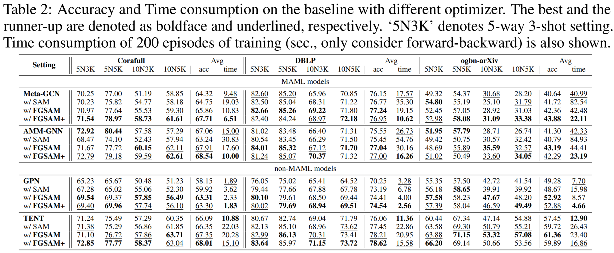
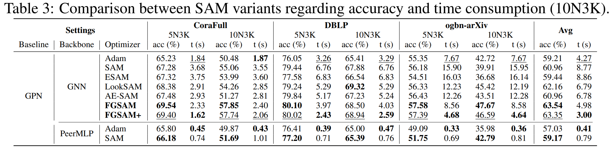
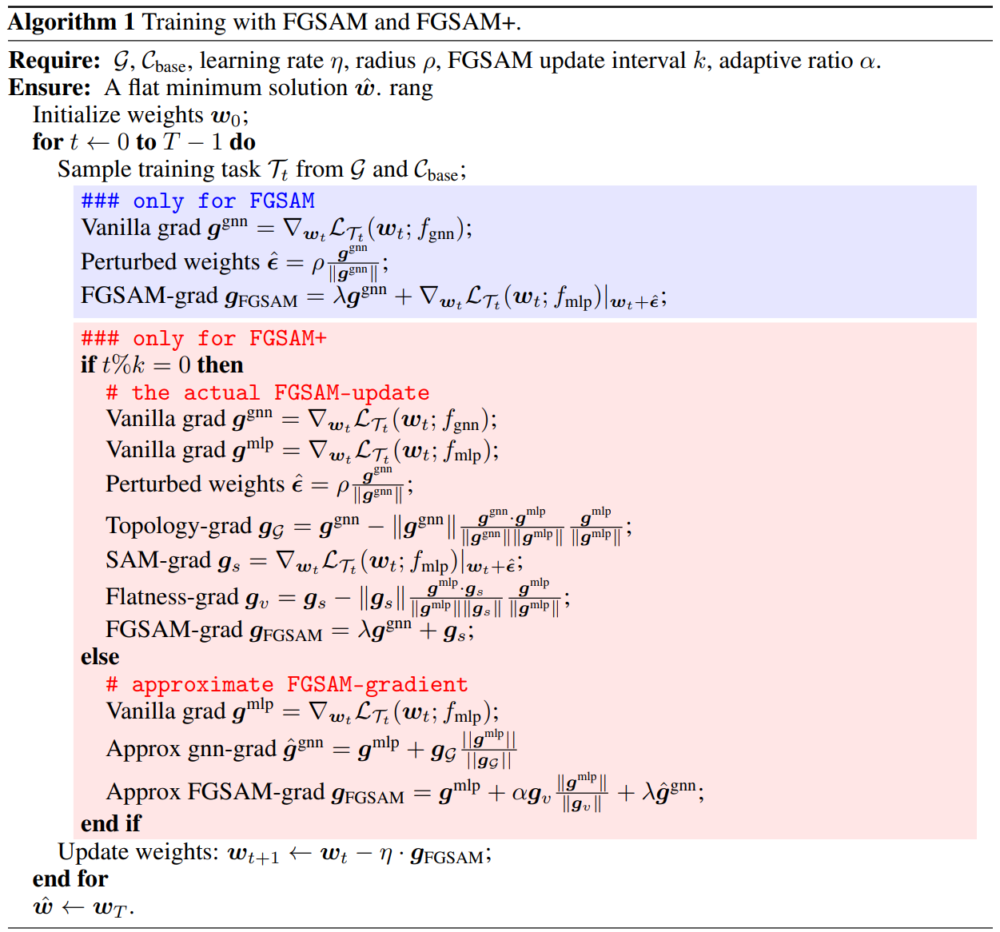

# FGSAM: Fast Graph Sharpness-Aware Minimization for Enhancing and Accelerating Few-Shot Node Classification

Official implementation for NeurIPS 2024 paper "*Fast Graph Sharpness-Aware Minimization for Enhancing and Accelerating Few-Shot Node Classification*" [[arxiv]](https://arxiv.org/abs/2410.16845), by Yihong Luo*, Yuhan Chen*, Siya Qiu, Yiwei Wang, Chen Zhang, Yan Zhou, Xiaochun Cao, Jing Tang (* means equal contribtuion)

### Abstract
Graph Neural Networks (GNNs) have shown superior performance in node classification. However, GNNs perform poorly in the Few-Shot Node Classification (FSNC) task that requires robust generalization to make accurate predictions for unseen classes with limited labels. To tackle the challenge, we propose the integration of Sharpness-Aware Minimization (SAM)--a technique designed to enhance model generalization by finding a flat minimum of the loss landscape--into GNN training. The standard SAM approach, however, consists of two forward-backward steps in each training iteration, doubling the computational cost compared to the base optimizer (e.g., Adam). To mitigate this drawback, we introduce a novel algorithm, Fast Graph Sharpness-Aware Minimization (FGSAM), that integrates the rapid training of Multi-Layer Perceptrons (MLPs) with the superior performance of GNNs. Specifically, we utilize GNNs for parameter perturbation while employing MLPs to minimize the perturbed loss so that we can find a flat minimum with good generalization more efficiently. Moreover, our method reutilizes the gradient from the perturbation phase to incorporate graph topology into the minimization process at almost zero additional cost. To further enhance training efficiency, we develop FGSAM+ that executes exact perturbations periodically. Extensive experiments demonstrate that our proposed algorithm outperforms the standard SAM with lower computational costs in FSNC tasks. In particular, our FGSAM+ as a SAM variant offers a faster optimization than the base optimizer in most cases. In addition to FSNC, our proposed methods also demonstrate competitive performance in the standard node classification task for heterophilic graphs, highlighting the broad applicability. 

### Evaluation Results





### Requirements

```
torch
torch-geometric
ogb
```

### Description
We provide examples for Meta-GCN (MAML-model) and GPN (non-MAML model), using different optimizers: Adam, SAM (`+SAM`), FGSAM (`+FGSAM`), FGSAM+ (`+FGSAMp`).

### Train model
Run `train.py` to train with the default setting, and the datasets will be downloaded automatically into `_data/`.

Or you can customize the hyper-parameters in `config.py`.

### Contact
Please contact **Yuhan Chen** (draym@qq.com or draym28@gmail.com) or **Yihong Luo** (yluocg@connect.ust.hk) if you have any question about this code.
